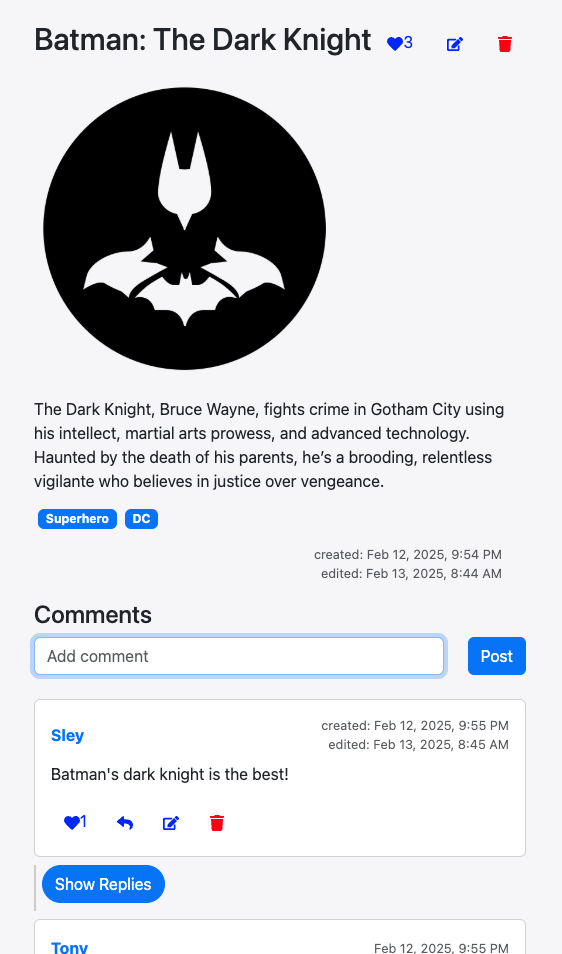
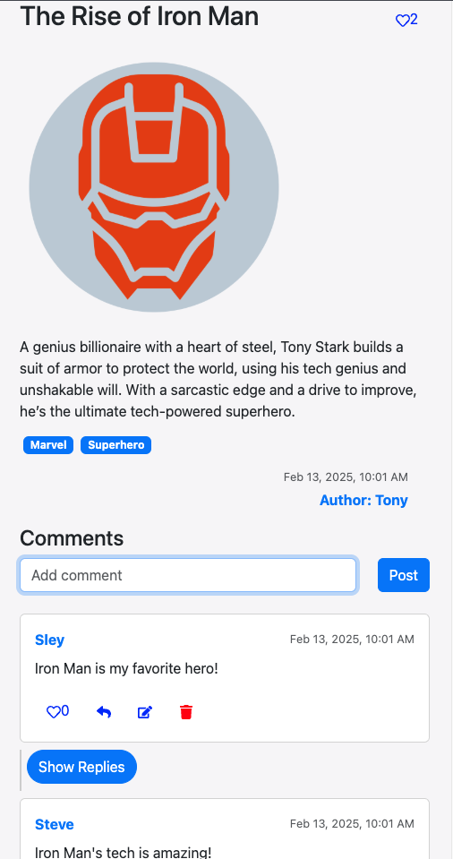

# WebApp - Post, Comment, and Media Platform

This is a web application I built using **TypeScript** for the frontend and **Golang** for the backend. The platform allows users to create posts, add media (text, photos, or videos), edit and manage comments, like content, and organize posts using tags. The app also features user authentication with session management handled by cookies.

---

## Features

### User Authentication

- **Login/Logout**: Users can securely log in and log out using their username and password.
- **Session Management**: Authentication is managed through cookies, ensuring that user sessions are tracked securely.

### Posts

- **Create Post**: Users can create posts with text, images, or videos.
- **Edit Post**: Only the creator of a post can edit it.
- **Delete Post**: Only the creator of a post can delete it.
- **Like Post**: Users can like posts.
- **Tags**: Posts can be tagged with relevant keywords for easier categorization.
- **Media Support**: Photos and videos can be uploaded alongside text when creating a post. These media files are securely stored on AWS S3.

### Comments

- **Add Comments**: Users can comment on posts.
- **Edit/Delete Comments**: Users can only edit or delete their own comments.
- **Comment Replies**: Comments support nested replies, allowing for threaded discussions.
- **Like Comments**: Users can like comments they find helpful or interesting.
- **Comment Permissions**: Only the creator of a comment can edit or delete it. Others can only reply or like the comment.

### File Storage

- **AWS Integration**: Media files (images, videos) uploaded along with posts or comments are securely stored in AWS S3.

---

## Tech Stack

### Frontend

- **TypeScript**: Provides static typing to improve development reliability experience and scalability.
- **React.ts**: Used for building the user interface.
- **Axios**: Used for making HTTP requests to the backend.
- **CSS/SCSS** and **TailwindCSS**: Used for styling the application.

### Backend

- **Golang**: Efficiently handles backend logic, including managing posts, comments, and user authentication.
- **GORM**: ORM used for interacting with the PostgreSQL database.
- **PostgreSQL**: The relational database stores user data, posts, comments, and tags.
- **AWS S3**: Used for cloud storage of media files (images, videos).
- **JWT/Cookies**: Secure user authentication and session management.

---

## Previews

